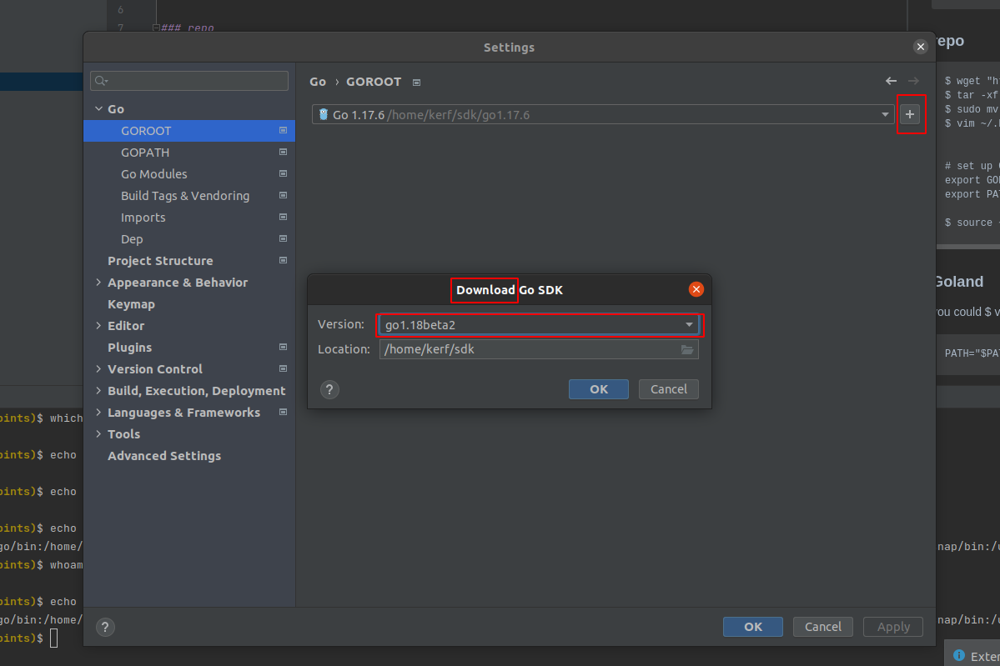

## Go installation

### apt

    $ sudo apt install golang-go

### repo

    $ wget "https://golang.org/dl/go${VERSION}.linux-${ARCH}.tar.gz"
    $ tar -xf "go${VERSION}.linux-${ARCH}.tar.gz"
    $ sudo mv -v go /usr/local
    $ vim ~/.bashrc


    # set up Go lang path #
    export GOPATH=$HOME/go
    export PATH=$PATH:/usr/local/go/bin:$GOPATH/bin

    $ source ~/.bashrc

### Goland

you could download go from goland



And then edit gopath

    $ vim /.bashrc

    PATH="$PATH:/home/kerf/sdk/go1.17.6/bin"

### UML automatic generator

https://github.com/jfeliu007/goplantuml

    $ go get github.com/jfeliu007/goplantuml/parser
    $ go install github.com/jfeliu007/goplantuml/cmd/goplantu@latest
    $ sudo apt install graphviz

in goland

    goplantuml -aggregate-private-members -recursive -show-aggregations -show-aliases -show-compositions -show-connection-labels -show-implementations -show-options-as-note ./app/Adapter/Out/Persistence/ > ./UML/adapterPersistence.puml

the visor it's a pluging

https://plugins.jetbrains.com/plugin/12496-go-linter

goplantuml -aggregate-private-members -recursive -show-aggregations -show-aliases -show-compositions
-show-connection-labels -show-implementations -show-options-as-note ./app/Adapter/Out/Persistence/ >
./UML/adapterPersistence.puml

### Class equivalent in golang

``` go
    type OutPin interface {
        Method()
    }
    
    type outPin struct {
        id     string
        status bool
    }
    
    func NewPin(id string) OutPin {
        return &outPin{id: id, status: false}
    }
    
    func FullDefinedPin(id string, status bool) *outPin {
        return &outPin{id: id, status: status}
    }
    
    func (outPin *outPin) Method(){
        
    }
    
```
